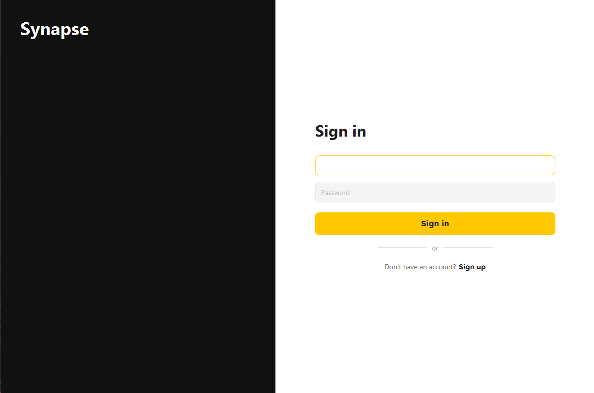

## Synapse Frontend — JavaFX Client

This document details the Frontend component (JavaFX Client) of the Synapse project. It covers application goals, UI architecture, key views, development setup, and the interface contracts with the backend services. The comprehensive API and data model documentation are managed via Swagger/OpenAPI on the backend side.

-----

### 🚀 Project Overview and Application Goals

Synapse is a collaborative study platform designed for teams and individual learners. It enables users to:

* Manage study tasks and daily schedules.
* Collaborate in groups, share resources, and communicate.
* Track progress and manage user profiles.

The Frontend is a **JavaFX desktop application** providing a modern, responsive user interface built on **FXML templates** and **CSS stylesheets**.

**Target Users:** Students, instructors, and small study groups.
**Problem Solved:** Coordination of study activities, transparent task organization, and group collaboration in a centralized hub.

-----

### 🏗️ Frontend Architecture Overview

The client-side architecture follows a Model-View-Controller (MVC) approach (common in JavaFX applications). It interacts with the backend using dedicated service layers.

```mermaid
flowchart LR
  subgraph Client[JavaFX Frontend]
    V[View (FXML + CSS)] --> C[Controller]
    C --> S[Service Layer (HTTP/WS)]
  end

  S -->|REST (JSON)| API[(Backend REST API)]
  S -->|WebSocket| WS[(Backend WS)]
```

* **View (FXML + CSS):** Defines the application layout and visual presentation. Located in `src/main/resources/.../views/`.
* **Controller:** Contains the presentation logic, handles user input, and coordinates data transfer by calling the Service Layer. Located in `com.synapse.client.controller`.
* **Service Layer:** Dedicated Java classes responsible for handling all network communication (HTTP/WebSocket) with the backend.

### 🗂️ Key Frontend View Files

| Path | Description |
| :--- | :--- |
| `views/auth/auth_view.fxml` | Initial marketing/landing screen. |
| `views/auth/sign_in.fxml` | User login screen. |
| `views/auth/sign_up.fxml` | User registration screen. |
| `views/MainView.fxml` | Primary application container with navigation. |
| `views/TodayView.fxml` | Daily tasks and overview dashboard. |
| `views/ProfileView.fxml` | User profile management and settings. |
| `views/groups/GroupsView.fxml` | List of study groups. |
| `views/groups/group_details.fxml` | Detailed view of a specific group. |
| **Styles:** `src/main/resources/com/synapse/client/style.css` | Global CSS styling for the application. |

-----

### 🌐 Backend Integration and API Contracts

The Frontend client relies entirely on the backend to provide business logic, persistence, and real-time data.

#### REST API Documentation

The complete list of REST endpoints (GET, POST, PUT, DELETE), parameters, response codes, and data transfer object (DTO) schemas can be found in the backend's API documentation.

* **Swagger UI:** `http://localhost:8080/swagger-ui/index.html` (Adjust URL based on backend configuration)

**Development Tips:**

* **Request Headers:** All REST calls must use standard headers, including `Content-Type: application/json`, `Accept: application/json`, and crucially, `Authorization: Bearer <token>` for authenticated requests.
* **DTO Schemas:** The Swagger models define the exact structure of JSON data expected and sent, eliminating the need for a separate ER diagram in this Frontend documentation.

#### WebSocket Endpoints (Real-time Communication)

If implemented, WebSocket endpoints are used for real-time updates (e.g., chat messages, live task status).

* **Connection URI:** Typically `ws://localhost:8080/ws` (refer to backend docs for the exact path).
* The Frontend service layer handles connection and message routing, often using the STOMP protocol.

-----

### 🖼️ User Interface Flow Examples

The following outlines the basic user workflow. **Screenshots should be placed in `Frontend/docs/images` and linked here.**

| Step | View File | Description |
| :--- | :--- | :--- |
| **1. Entry** | `auth_view.fxml` | Landing page, directs user to sign in or register. |
| **2. Auth** | `sign_in.fxml`/`sign_up.fxml` | Handles user credentials via REST API calls. |
| **3. Main Hub** | `MainView.fxml` | Primary container with side navigation to key features. |
| **4. Daily Focus** | `TodayView.fxml` | Overview of tasks scheduled for the current day. |
| **5. Groups** | `GroupsView.fxml` | List of user's study groups, leads to detail view. |
| **6. Profile** | `ProfileView.fxml` | Allows editing personal data and application settings. |

*Example linking a screenshot:*

```markdown



```

-----

### 🛠️ Development Setup and Launch

#### Prerequisites

* Java Development Kit (JDK) 21 (or the version required by the project)
* Apache Maven 3.9+
* The Backend service must be running and accessible (e.g., at `http://localhost:8080`).

#### Launch Options

1.  **From IDE (IntelliJ IDEA):** Open the `Frontend` module and run the main JavaFX application class.
2.  **Using Maven Plugin:** Execute the following command from the project root directory:
    ```bash
    mvn -pl Frontend -am clean javafx:run
    ```

**Note:** For the application to function correctly, the backend service must be running to handle authentication and data requests.