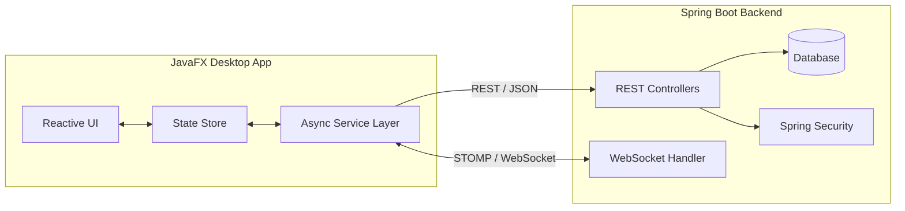
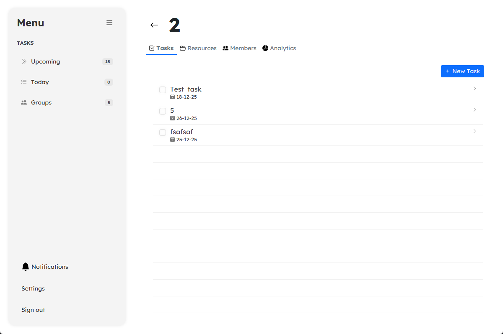
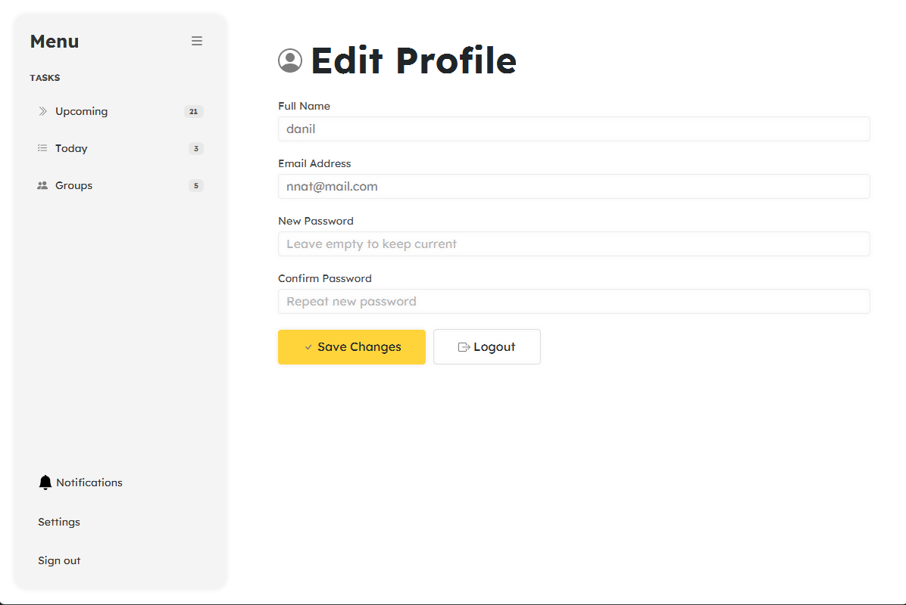

# 🧠 Synapse — Collaborative Study Platform

**Synapse** is an educational platform designed to facilitate collaborative learning. It allows students to form study groups, manage shared tasks, solve problems together, and exchange resources in a centralized environment.

The project is implemented as a distributed system consisting of two distinct parts:

1.  **Backend (Server):** REST API & WebSocket server built with **Spring Boot**.
2.  **Frontend (Client):** A rich desktop application built with **JavaFX**.

-----

## 🏗️ System Architecture

The application follows a Client-Server architecture. The JavaFX client acts as a "thick client," handling presentation logic and state management, while the Spring Boot server handles business logic, persistence, and security.



-----

## 🔧 Backend Overview (Server)

The server side is a robust REST API application providing the core logic for the platform.

### Key Technologies

* **Framework:** Spring Boot 3
* **Security:** Spring Security (Session-based)
* **Real-time:** WebSockets (STOMP) for notifications
* **Testing:** JUnit & Mockito
* **Containerization:** Docker (for app and test execution)

### 🔐 Security & Architecture Decision

The application uses **Session-based Authentication** (Stateful).

> *Note:* While REST APIs typically strive for statelessness (using JWT), this project deliberately uses Session Cookies (`JSESSIONID`). Given that the client is a **JavaFX Desktop Application** (Rich Client) rather than a browser-based SPA (like React), maintaining a session state is a valid and efficient architectural choice that simplifies security context management.

### 📚 API Documentation

The full API specification is available via Swagger UI (requires the backend to be running):

* **URL:** `http://localhost:8080/swagger-ui/index.html`

-----

## 💻 Frontend Overview (Client)

The client is a modern JavaFX application that leverages a **Reactive Architecture** to ensure a responsive user experience.

### Key Features

* **Centralized State Management:** Uses a **Store Pattern** (similar to Redux). Controllers do not store data; they bind to `ObservableLists` in Stores (`TaskStore`, `GroupsStore`).
* **Reactive UI:** Views like "Today" and "Upcoming" are live `FilteredList` views of a single master data source.
* **Real-Time Sync:** Integrates a custom `StompClient` (Java 11 `HttpClient` + `WebSocket`) to receive push notifications about new tasks, files, or invites instantly.
* **Thread Safety:** All network I/O is asynchronous (`CompletableFuture`), with UI updates safely marshaled to the JavaFX Application Thread.

### Tech Stack

* **Java 21**
* **JavaFX** (FXML + CSS)
* **Gson** (JSON Serialization)
* **ControlsFX** (Notifications & UI components)

-----

## 🚀 Setup and Execution

### Prerequisites

* **Java JDK 21**
* **Maven 3.9+**
* **Docker** (Optional, for containerized backend run)

### 1\. Running the Backend

You can run the backend locally or via Docker.

```bash
# Using Maven
mvn spring-boot:run

# OR using Docker
docker-compose up --build
```

*Once started, verify the API is running at `http://localhost:8080`.*

### 2\. Running the Frontend

Open the `Frontend` module in your IDE or run via terminal:

```bash
cd Frontend
mvn clean javafx:run
```

-----

### 📸 Screenshots



